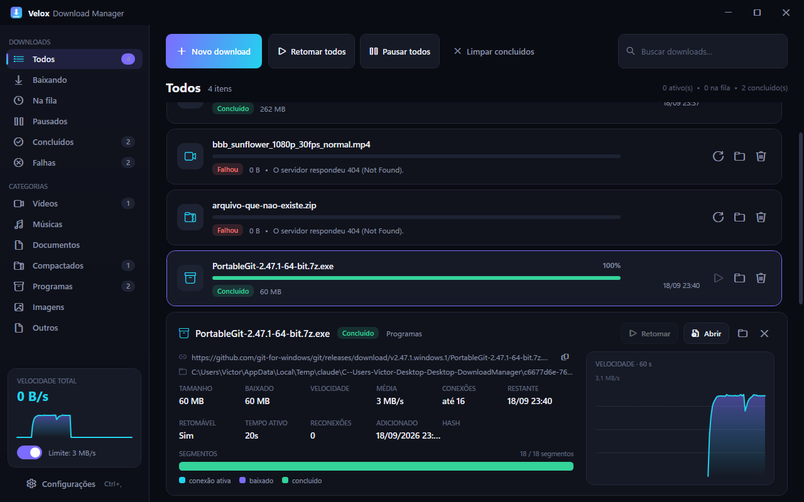
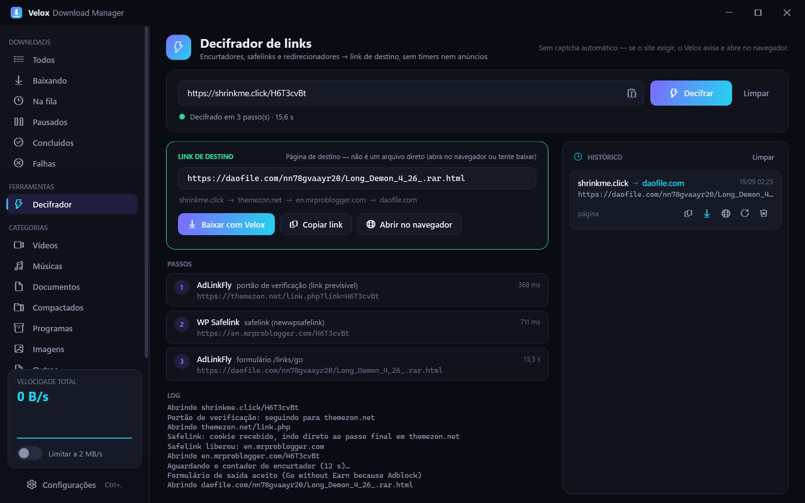

# Velox Download Manager

Gerenciador de downloads para Windows em C# / .NET 10 + WPF, com engine de download
segmentado (estilo IDM) que usa toda a banda disponível e retoma downloads
interrompidos exatamente de onde pararam — mesmo depois de fechar o programa,
queda de conexão ou reinício do PC.



## Recursos

**Engine (Velox.Core)**
- Download com até **64 conexões paralelas** por arquivo (HTTP Range).
- **Segmentação dinâmica**: quando uma conexão termina, ela "rouba" metade do maior
  segmento restante — todas as conexões ficam ocupadas até o último byte.
- **Retomada real**: o progresso de cada segmento é persistido em JSON; ao reabrir
  o app os downloads continuam de onde pararam. Valida ETag/tamanho e reinicia
  automaticamente se o arquivo mudou no servidor.
- **Resiliência**: cada conexão tenta reconectar com backoff exponencial (até 30 s),
  timeout de leitura para conexões travadas, 429/5xx tratados como transitórios,
  e re-agendamento automático de downloads que falharem.
- Limitador de banda global (token bucket), fila com N downloads simultâneos,
  pré-alocação com arquivo esparso (sem zero-fill de gigabytes), gravação
  posicional thread-safe (`RandomAccess.WriteAsync`).
- Verificação de integridade (MD5 / SHA-1 / SHA-256), detecção de nome via
  `Content-Disposition`, categorias automáticas por extensão/MIME, cabeçalhos
  customizados (Cookie, Authorization, Referer), proxy e User-Agent configuráveis.

**Interface (Velox.App)**
- Tema escuro com chrome customizado (cantos arredondados via DWM), sidebar com
  filtros e categorias, cards com barra que mostra **cada segmento** em tempo real.
- Painel de detalhes com estatísticas, mapa de segmentos e gráfico de velocidade (60 s).
- Diálogo "Novo download" que sonda o servidor enquanto você digita (tamanho, tipo,
  suporte a retomada), lote de vários links, opções avançadas.
- Captura de links da área de transferência, arrastar-e-soltar de URLs, atalhos
  (Ctrl+N, Ctrl+V, Delete, Esc), bandeja do sistema com menu e notificações,
  instância única, iniciar com o Windows, toasts in-app.

**Integração com o navegador ([browser-extension](browser-extension))**
- Extensão Manifest V3 para Chrome, Edge, Brave, Vivaldi e Opera que **intercepta todo
  download do navegador** e o entrega ao Velox — com cookies e User-Agent da sessão —
  como fazem IDM e JDownloader. Menu de contexto "Baixar com Velox", atalho
  `Alt+Shift+V`, popup com liga/desliga, tamanho mínimo e tipos ignorados.
- Comunicação por **Native Messaging** (canal oficial do Chrome): o próprio
  `VeloxDM.exe` atua como host e repassa ao app pelo named pipe `VeloxDM_Bridge`.
  Se o Velox estiver fechado, é aberto automaticamente; se não responder, o download
  segue no navegador. Registro em HKCU (sem administrador), feito pelo app a cada abertura.
- Instalação: Configurações → Navegador → *Instalar integração*, depois
  `chrome://extensions` → Modo do desenvolvedor → *Carregar sem compactação* → pasta
  `extension` ao lado do executável. Detalhes em [browser-extension/README.md](browser-extension/README.md).

**Decifrar links ([Velox.Core/Resolvers](src/Velox.Core/Resolvers))**
- Resolve encurtadores/safelinks até a URL de destino sem passar por timers e páginas de
  anúncio — como o bypass.city ou os *decrypters* do JDownloader. View **Decifrador** na
  sidebar (ou `Ctrl+B`): mostra cada passo, o link de destino com **Copiar / Baixar / Abrir**
  e um histórico persistente dos links decifrados (cada um com Copiar e Baixar); o diálogo
  "Novo download" decifra automaticamente quando a URL colada é uma página; a extensão
  ganha o menu **Decifrar link com Velox**.
- Resolvedores por *padrão de conteúdo* (funcionam em qualquer domínio do mesmo script):
  **AdLinkFly** (ShrinkMe, ShrinkEarn, Clk.sh, GPLinks, DropLink… — portão de "verificação
  humana" com link previsível + formulário `/links/go`), **WP Safelink** (desvio por blog
  com `newwpsafelink` — um único POST no lugar de N saltos com timer) e
  **redirecionamentos** (meta refresh, `location=`, google.com/url).
- Limite deliberado: **não resolve CAPTCHA** validado no servidor; nesse caso avisa e
  oferece abrir no navegador. Hospedeiros de arquivo (daofile, mediafire…) ainda não têm
  resolvedor próprio — o destino é mostrado como página.



## Compilar

Requer o [.NET 10 SDK](https://dotnet.microsoft.com/download).

```bash
dotnet build VeloxDM.sln -c Release
```

Executável: `src/Velox.App/bin/Release/net10.0-windows/VeloxDM.exe`

Para gerar um único `.exe` (framework-dependent):

```bash
dotnet publish src/Velox.App/Velox.App.csproj -c Release -r win-x64 --self-contained false -p:PublishSingleFile=true -o publish
```

## Estrutura

```
src/Velox.Core/            biblioteca sem dependência de UI
  Engine/DownloadTask.cs   ciclo de vida de um download: sondagem, segmentos, workers, retry, finalização
  Engine/UrlProber.cs      requisição Range: bytes=0-0 para descobrir tamanho/nome/retomada
  Engine/BandwidthLimiter  limitador global de banda
  Services/DownloadManager fila, concorrência, persistência, estatísticas, auto-retry
  Services/StateStore      downloads.json / settings.json em %LOCALAPPDATA%\VeloxDM
src/Velox.App/             WPF (MVVM)
  Themes/Theme.xaml        paleta e estilos (botões, inputs, toggle, slider, scrollbar, menus)
  Controls/SegmentBar.cs   barra de progresso por segmento
  Controls/SpeedGraph.cs   gráfico de área da velocidade
  ViewModels/              MainViewModel, DownloadItemViewModel, AddDownloadViewModel, SettingsViewModel
  Views/                   MainWindow, BypassView (view do Decifrador), AddDownloadWindow, SettingsWindow, MessageWindow
  Services/                ClipboardMonitor, TrayService, WindowEffects, Log
  Services/NativeHost.cs   modo "native messaging host" (stdin/stdout ↔ named pipe)
  Services/BridgeServer.cs servidor do named pipe que recebe os downloads da extensão
  Services/BrowserIntegration.cs  manifesto do host + chaves de registro dos navegadores
  Program.cs               Main: decide entre modo host (iniciado pelo Chrome) e UI
browser-extension/         extensão MV3 (copiada para <saída>/extension)
```

Dados do app: `%LOCALAPPDATA%\VeloxDM\` (`downloads.json`, `settings.json`, `velox.log`,
`com.velox.dm.json` — manifesto do host nativo).
Arquivos em andamento ficam com a extensão `.vxpart` e são renomeados ao concluir.
